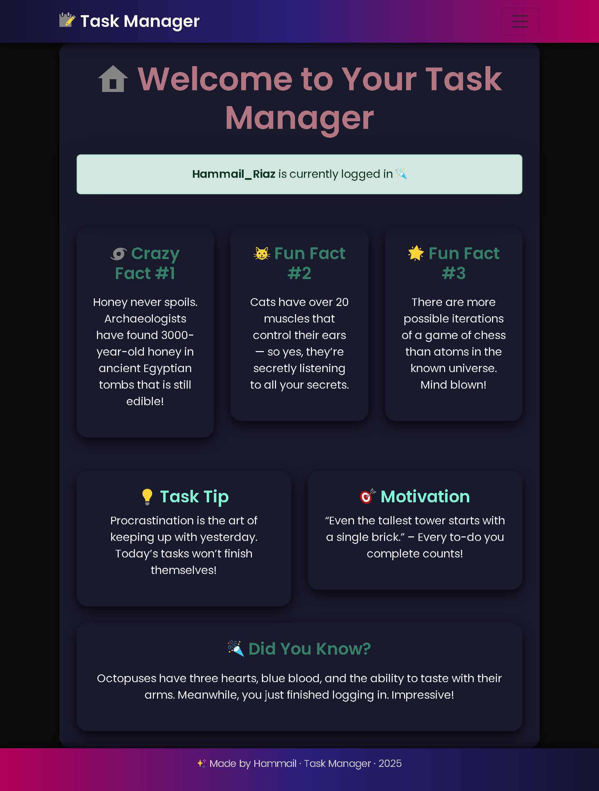
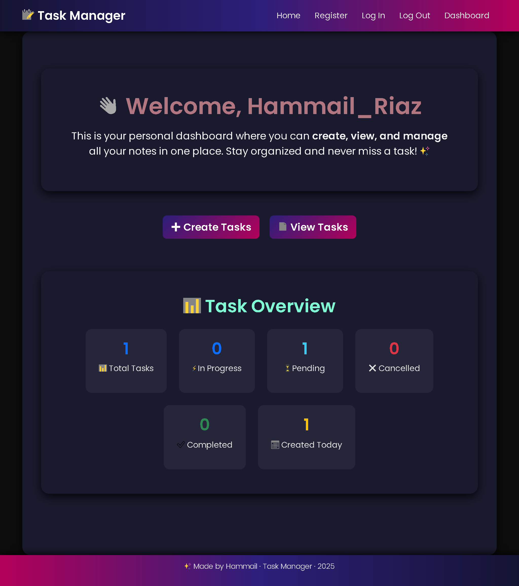

# 📘 Task Manager – Documentation  

## 1. 🚀 Overview  
The **Task Manager** is a web-based productivity application built with **Flask**, allowing users to create, edit, delete, and filter tasks.  
It is designed with **authentication**, **user-specific data**, and a **modern responsive UI** that works seamlessly on both desktop and mobile devices.  

This project is ideal for learning:  
- 🟦 Flask Blueprints (modular project structure)  
- 🗄️ Database handling with SQLAlchemy  
- 🔑 Flask-Login (authentication & user sessions)  
- 📝 Form handling with Flask-WTF (CSRF-protected forms)  
- 🎨 Responsive frontend design with Bootstrap & custom CSS  
---

## 10. 📸 Screenshots  

- 🖥️ **Desktop View** – Wide layout with cards in columns.  
  
  
- 📊 **Dashboard** – Statistics overview with task lists.  
  
  
---

## 2. ⚙️ Features  
✔️ **User Authentication**  
- 👤 Register new accounts  
- 🔐 Login & logout securely  
- 🔑 Passwords stored as secure hashes  

✔️ **Task Management**  
- ➕ Create new tasks with title, description, and status  
- ✏️ Edit existing tasks (only your own tasks)  
- 🗑️ Delete tasks with confirmation prompt  
- 🔎 Filter tasks by:  
  - 📋 All  
  - ⏳ In Progress  
  - 🟡 Pending  
  - ❌ Cancelled  
  - ✅ Completed  
  - 📅 Created Today  

✔️ **Dashboard**  
- 📊 Displays task statistics:  
  - 📌 Total tasks  
  - ✅ Tasks completed, pending, in progress, cancelled  
  - 📅 Tasks created today  
- 📂 Lists tasks grouped by status  

✔️ **Responsive UI**  
- 📱 Mobile-friendly layout  
- 🌈 Gradient navbar & footer  
- 🧾 Clean card-based design  
- ⚡ Flash messages for feedback (success, danger, warning, info)  

---

## 3. 🛠️ Tech Stack  

### Backend  
- 🐍 **Python 3**  
- 🌐 **Flask** (with Blueprints)  
- 🔑 **Flask-Login** → authentication & session handling  
- 📝 **Flask-WTF** → forms & CSRF protection  
- 🗄️ **SQLAlchemy** → ORM for database  
- 🔒 **Werkzeug** → password hashing  

### Frontend  
- 🖼️ **HTML5 / Jinja2 Templates**  
- 🎨 **CSS3 (custom styles)**  
- 🅱️ **Bootstrap 5** (responsive layout & utilities)  

### Database  
- 💾 **SQLite / MySQL** (depending on deployment)  

---

## 4. 📂 Project Structure  

```
task_manager/
│── app/
│   ├── __init__.py          # App factory
│   ├── extensions.py        # db, login_manager setup
│   ├── blueprints/
│   │   ├── auth/            # Authentication (login, register, logout)
│   │   ├── tasks/           # Task CRUD operations
│   │   ├── profile/         # Dashboard & stats
│   │   └── main/            # Homepage
│   ├── templates/           # HTML templates
│   ├── static/
│   │   └── css/style.css    # Custom styling
│   └── models.py            # Database models
│
│── migrations/              # Database migrations (Flask-Migrate)
│── requirements.txt         # Dependencies
│── run.py                   # Entry point
```

---

## 5. 🔑 Authentication Flow  

1. 📝 **Register** → user creates account with unique username & password.  
2. 🔒 Password is hashed using **Werkzeug’s `generate_password_hash`**.  
3. 🔑 **Login** → user enters username & password, verified using `check_password_hash`.  
4. 🕒 Flask-Login manages sessions → user stays logged in until logout.  
5. 🛡️ **Access Control**:  
   - Only logged-in users can access `/dashboard`, `/tasks/*`.  
   - Each user can only manage their own tasks.  

---

## 6. 📝 Task Management Flow  

- **Create Task**  
  - 🆕 Enter title, description, and status.  
  - 🚫 Prevents duplicate task titles for the same user.  
  - ⏰ Saves with timestamp (`datetime.now()`).  

- **Edit Task**  
  - ✏️ Only owner can edit.  
  - 🔄 Updates title, description, and status.  

- **Delete Task**  
  - 🗑️ Only owner can delete.  
  - 📩 Requires **POST request** with CSRF token for security.  
  - ✅ Confirmation prompt before deletion.  

- **View Tasks**  
  - 🗂️ Tasks displayed in card format.  
  - 🎛️ Filter dropdown for quick navigation.  

---

## 7. 🎨 UI & Responsiveness  

- 🌈 **Navbar & Footer**: Gradient background with shadows.  
- 📦 **Content Cards**: Dark theme, rounded corners, neon hover effects.  
- 🎛️ **Buttons**: Gradient styles, responsive sizing.  
- 📱 **Mobile Adjustments**:  
  - 🔄 Buttons stack vertically or resize to fit small screens.  
  - 🔎 Text resizes for readability.  
  - 🧩 Task cards remain compact with reduced padding.  

---

## 8. 🔐 Security Features  

- 🛡️ **CSRF Protection** on all forms (`form.hidden_tag()` via Flask-WTF).  
- 🔒 **Password Hashing** (no plaintext storage).  
- 🔑 **Session Security** with Flask-Login.  
- 🧍 **Authorization** → users can only edit/delete their own tasks.  

---

## 9. 🚀 Deployment  

- 💻 Works locally (`flask run`) or hosted (e.g., PythonAnywhere, Heroku).  
- 🔄 Database migrations handled with `Flask-Migrate`.  
- 🌍 Can be scaled with MySQL/Postgres in production.  


